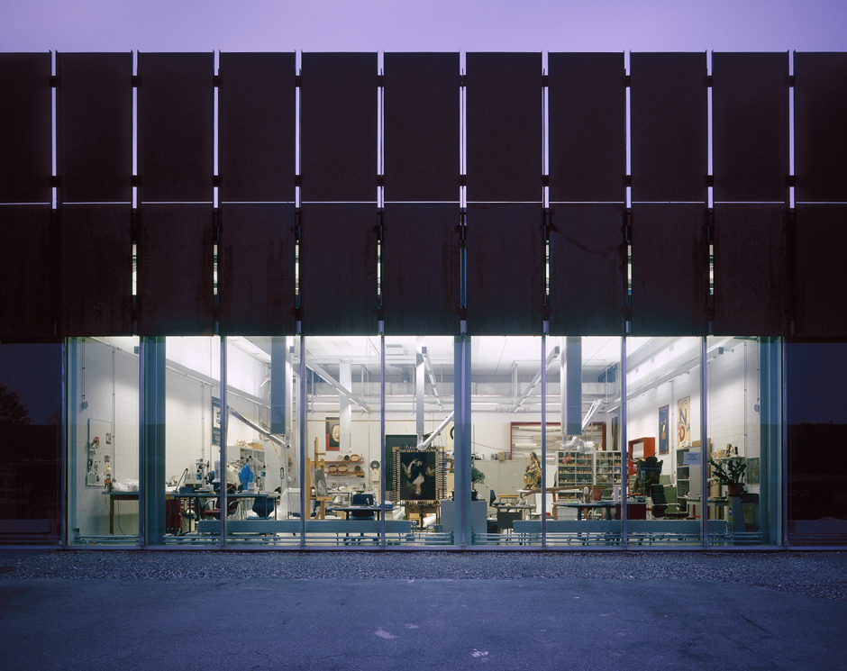

# Exkursion zum Sammlungszentrum

Liebe Freunde der Vergangenheit

Das Sammlungszentrum der Schweiz in Affoltern ist nur für organisierte Gruppen zugänglich. Wir haben für moneynotlove eine Führung durch die Designgeschichte organisiert. 

###### Freitag 18. Oktober, Treffpunkt um 13:00 am Bahnhof Enge {.text-hard}

- hier gehts zur [Anmeldung (Google Forms)](https://forms.gle/dum6zpNZNQGYkqEs9)

Die 90 minütige Führung kostet CHF 180. Deshalb führen wir die Exkursion durch, sobald sich 10 Personen angemeldet haben (jeweils 18.-). 

Liebe Grüsse

Das Generalsekretariat: Nando & Fabio

